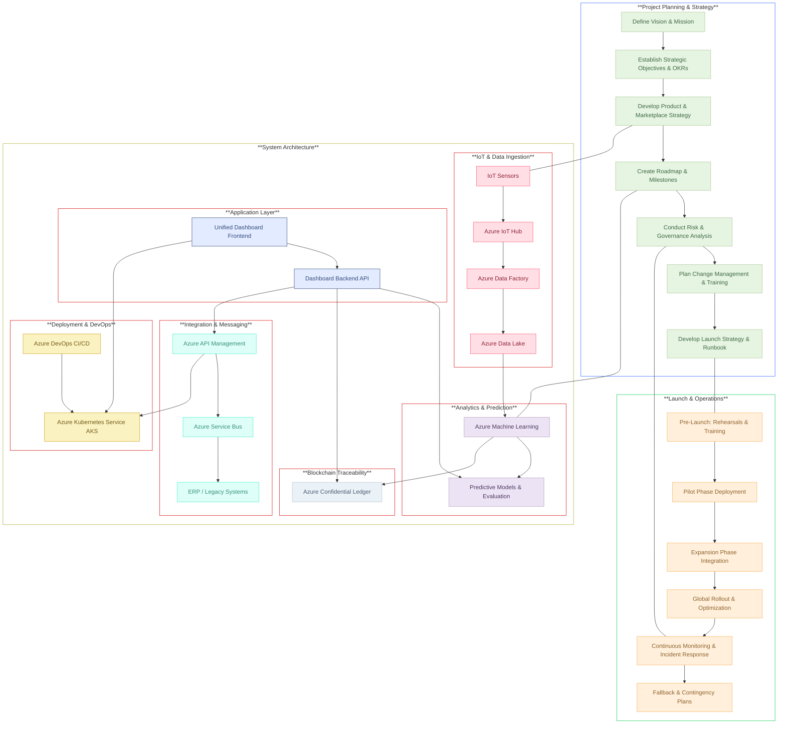

## AlumiCatalyst
Enterprise-grade digital transformation platform for the aluminum manufacturing industry. Built on the robust Azure stack, it seamlessly integrates IoT, AI, and blockchain to optimize scrap recovery, reduce carbon emissions, and enhance operational efficiency

---
### Table of Contents
- [Overview](#overview)
- [Key Features](#key-features)
- [Architecture](#architecture)
- [Technology Stack](#technology-stack)
- [Project Structure](#project-structure)
- [Getting Started](#getting-started)
- [Testing & Deployment](#testing--deployment)
- [Documentation](#documentation)

---
### Overview

AlumiCatalyst transforms aluminum manufacturing by:
- Capturing real-time sensor data via Azure IoT Hub.
- Processing data with Azure Data Factory and Azure Machine Learning for predictive analytics.
- Securing production data with blockchain traceability using Azure Confidential Ledger.
- Delivering actionable insights through a unified, interactive dashboard.
- Seamlessly integrating with ERP and legacy systems via Azure API Management.
- Deploying a scalable, resilient solution using Azure Kubernetes Service and DevOps pipelines.

---

### Key Features

- **IoT Data Ingestion:** Real-time sensor data capture and preprocessing.
- **Predictive Analytics:** Advanced machine learning models forecasting scrap loss and carbon emissions.
- **Blockchain Traceability:** Immutable logging of production events for compliance and carbon credit verification.
- **Unified Dashboard:** An intuitive interface providing real-time metrics, customizable alerts, and interactive data visualizations.
- **ERP Integration:** Seamless connectivity with existing legacy systems.
- **Scalable Deployment:** Automated CI/CD pipelines and orchestration with Azure Kubernetes Service.
- **Robust Security:** Comprehensive encryption, role-based access, and compliance measures.
---

## Architecture

AlumiCatalyst is designed as a modular, microservices-based system. Key components include:
- **IoT & Data Ingestion:** Azure IoT Hub, Data Factory, Data Lake.
- **Analytics Engine:** Azure Machine Learning, Synapse Analytics, and Power BI.
- **Blockchain Module:** Azure Confidential Ledger and smart contracts.
- **Application Layer:** React-based frontend and Node.js/Python backend.
- **Integration Layer:** Azure API Management, Service Bus.
- **Deployment & DevOps:** Azure Kubernetes Service (AKS) and Azure DevOps CI/CD.


### Technology Stack

| **Category**              | **Components**                                                                                          |
|---------------------------|---------------------------------------------------------------------------------------------------------|
| **Cloud Platform**        | Microsoft Azure                                                                                         |
| **Compute & Orchestration** | Azure Kubernetes Service (AKS), Azure Functions for serverless processing                             |
| **Data Services**         | Azure IoT Hub, Azure Data Factory, Azure Data Lake, Azure SQL Database                                  |
| **Analytics & AI**        | Azure Machine Learning, Azure Synapse Analytics, Power BI for visualization                             |
| **Blockchain**            | Azure Confidential Ledger                                                                               |
| **Security**              | Azure Active Directory (RBAC), Azure Key Vault                                                         |
| **Integration**           | Azure API Management, Azure Service Bus                                                                |
| **DevOps**                | Azure DevOps CI/CD pipelines, Helm charts for deployment management                                    |

---

### Project Structure

```
/AlumiCatalyst
├── README.md
├── docs/
│   ├── Strategy/
│   │   ├── 01_Executive_Summary_and_Vision.md
│   │   ├── 02_Market_and_User_Insights.md
│   │   ├── 03_Objectives_and_Key_Results_OKRs.md
│   │   ├── 04_Product_and_Marketplace_Strategy.md
│   │   ├── 05_Roadmap_and_Milestones.md
│   │   ├── 06_Risk_and_Governance.md
│   │   ├── 07_Change_Management.md
│   │   ├── 08_Marketing_Plan.md
│   │   ├── 09_Launch_Strategy.md
│   │   ├── 10_Onboarding.md
│   │   └── 11_User_Training.md
│   │   └── 12_Simulation_Based_Training.md 
│   ├── Technical/
│   │   ├── 01_Architecture.md
│   │   ├── 02_Epics_and_Strategic_Alignment.md
│   │   ├── 03_Requirements_FRs_NFRs.md
│   │   ├── 04_Data_and_Analytics_Integration.md
│   │   ├── 05_QA_and_Test_Automation.md
│   │   ├── 06_Finance_cost_model.md
│   │   ├── 07_Incident_response.md
│   │   ├── 08_API_docs.md
│   │   └── 09_Integration_guide.md
│   │   ├── 10_Predictive_Maintenance_and_Energy_Optimization.md
│   │   ├── 11_Supply_Chain_Integration.md
│   │   ├── 12_Enhanced_Sustainability_Reporting.md
│   │   ├── 13_User_Feedback_and_Continuous_Improvement.md
│   │   └── 14_Expanded_Security_and_Compliance.md
├── design/
├── src/
│   ├── iot/
│   ├── analytics/
│   ├── blockchain/
│   ├── dashboard/
│   └── integration/
├── tests/
│   ├── unit/
│   └── integration/
└── deploy/
    ├── azure-pipelines.yml
    └── helm/
```
---

### Getting Started


1. **Clone the Repository:**
   ```bash
   git clone https://github.com/suprachakra/AlumiCatalyst.git
   cd AlumiCatalyst
   ```
2. **Install Dependencies:**  
   Follow instructions in each module’s README (e.g., in `src/` and `tests/` folders).

3. **Setup Azure Services:**  
   Configure your Azure IoT Hub, Data Factory, AKS, etc., as per the provided documentation in `/docs/Technical`.

4. **Run Tests:**
   ```bash
   cd tests
   pytest
   ```
5. **Deploy:**
   Use the provided `azure-pipelines.yml` and Helm charts in `/deploy/helm` to deploy on AKS.

---

### Testing & Deployment

- **Testing:**  
  Unit tests and integration tests are located in the `tests/` directory.
- **Deployment:**  
  CI/CD is managed via Azure DevOps. Helm charts and YAML configuration files in `deploy/` facilitate scalable deployments on AKS.

---

### Documentation

Detailed documentation is available under the `/docs` folder:
- **Strategy:** Vision, market insights, OKRs, product strategy, roadmap, risk & change management, launch, onboarding, and training.
- **Technical:** Architecture, epics, requirements, integration, finance, incident response, API documentation, and more.
