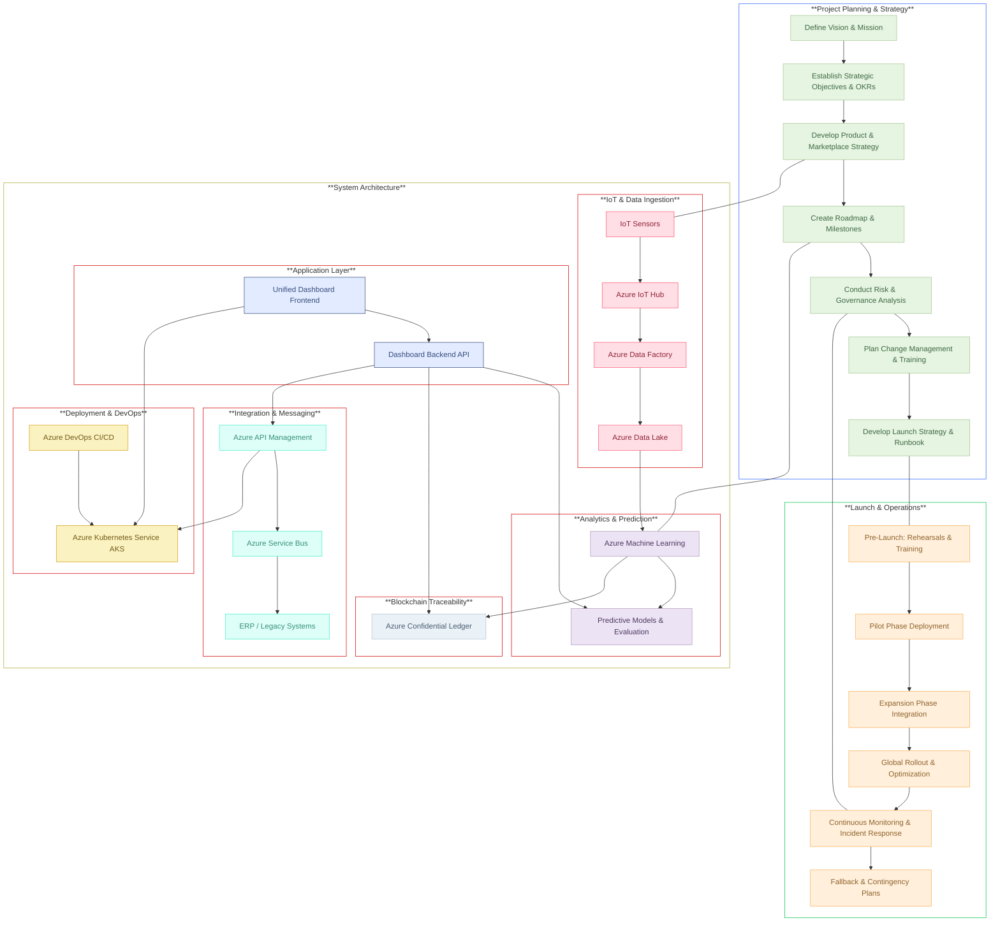

# AlumiCatalyst
Enterprise-grade digital transformation platform for the aluminum manufacturing industry. Built on the robust Azure stack, it seamlessly integrates IoT, AI, and blockchain to optimize scrap recovery, reduce carbon emissions, and enhance operational efficiency

