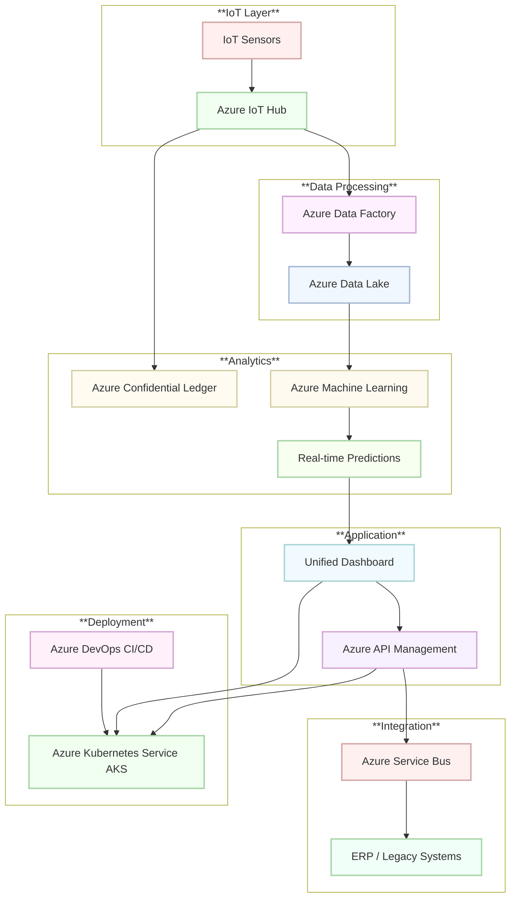

# Architecture

## Overview
AlumiCatalyst is built on a modular, microservices-based architecture leveraging Azure’s robust cloud services. This design enables real-time data ingestion, advanced analytics, blockchain traceability, and a unified dashboard, all while ensuring scalability, resilience, and high performance.

## Key Components
- **IoT Data Acquisition:**  
  - Utilizes Azure IoT Hub to capture real-time sensor data.
  - Preprocessing is handled by Azure Data Factory.
  - Raw and processed data are stored in Azure Data Lake.

- **Analytics Engine:**  
  - Implements Azure Machine Learning for predictive analytics.
  - Provides real-time insights, anomaly detection, and “what‑if” simulation capabilities.

- **Blockchain Module:**  
  - Uses Azure Confidential Ledger to create an immutable log of production events.
  - Supports secure traceability and regulatory reporting for carbon credits.

- **Dashboard and UI:**  
  - Frontend built with React and deployed on Azure App Service.
  - Backend services (Node.js/Python) aggregate data and expose RESTful APIs.

- **Integration Layer:**  
  - Managed via Azure API Management for secure communication with ERP and legacy systems.
  - Employs Azure Service Bus for asynchronous messaging between services.

- **Deployment and Orchestration:**  
  - Containerized microservices orchestrated using Azure Kubernetes Service (AKS).
  - CI/CD pipelines are implemented using Azure DevOps.

## Data Flow & Security
- **Data Flow:**  
  - Sensor → IoT Hub → Data Factory → Data Lake → Machine Learning → Dashboard/API
- **Security Measures:**  
  - Data is encrypted in transit and at rest.
  - Role-based access control is enforced via Azure Active Directory.
  - Regular security audits and compliance checks are conducted.

## Diagram
Refer below to the supplementary architecture diagram for a visual representation.

