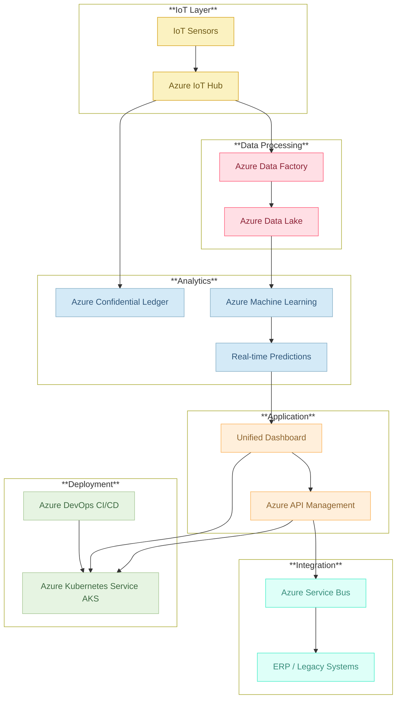

## Architecture

### Overview
AlumiCatalyst is built on a modular, microservices-based architecture leveraging Azure’s robust cloud services. This design enables real-time data ingestion, advanced analytics, blockchain traceability, and a unified dashboard, all while ensuring scalability, resilience, and high performance.

### Key Components
- **IoT & Data Ingestion:**  
  - **Azure IoT Hub:** Captures real-time sensor data from the production environment.
  - **Azure Data Factory:** Preprocesses and transforms raw sensor data.
  - **Azure Data Lake:** Stores both raw and processed data for long-term analytics.

- **Analytics Engine:**  
  - **Azure Machine Learning:** Hosts predictive models to forecast scrap loss and carbon emissions.
  - **Evaluation & Monitoring:** Provides real-time anomaly detection and “what-if” simulation capabilities.

- **Blockchain Traceability:**  
  - **Azure Confidential Ledger:** Implements an immutable ledger for production event logging, ensuring regulatory compliance and transparent carbon credit verification.

- **Application Layer (Dashboard):**  
  - **Frontend (React):** Offers an intuitive, customizable user interface.
  - **Backend (Node.js/Python):** Aggregates data and exposes RESTful APIs for dashboard functionalities.
  
- **Integration & Messaging:**  
  - **Azure API Management:** Facilitates secure API exposure and integration with ERP and legacy systems.
  - **Azure Service Bus:** Supports asynchronous messaging between microservices.

- **Deployment & Orchestration:**  
  - **Azure Kubernetes Service (AKS):** Hosts containerized microservices to ensure scalability.
  - **Azure DevOps:** Provides CI/CD pipelines for continuous integration, testing, and deployment.

### Data Flow & Security
- **Data Flow:**  
  - **Flow:** Sensors → IoT Hub → Data Factory → Data Lake → Machine Learning → Dashboard/API  
  - **Blockchain Integration:** IoT Hub also forwards event data to the Confidential Ledger for secure traceability.
  
- **Security Measures:**  
  - **Encryption:** All data is encrypted both in transit and at rest.
  - **Access Control:** Role-based access is enforced via Azure Active Directory.
  - **Compliance:** Regular security audits and compliance checks are performed.

### Diagram
Refer below to the architecture diagram for a visual representation.

