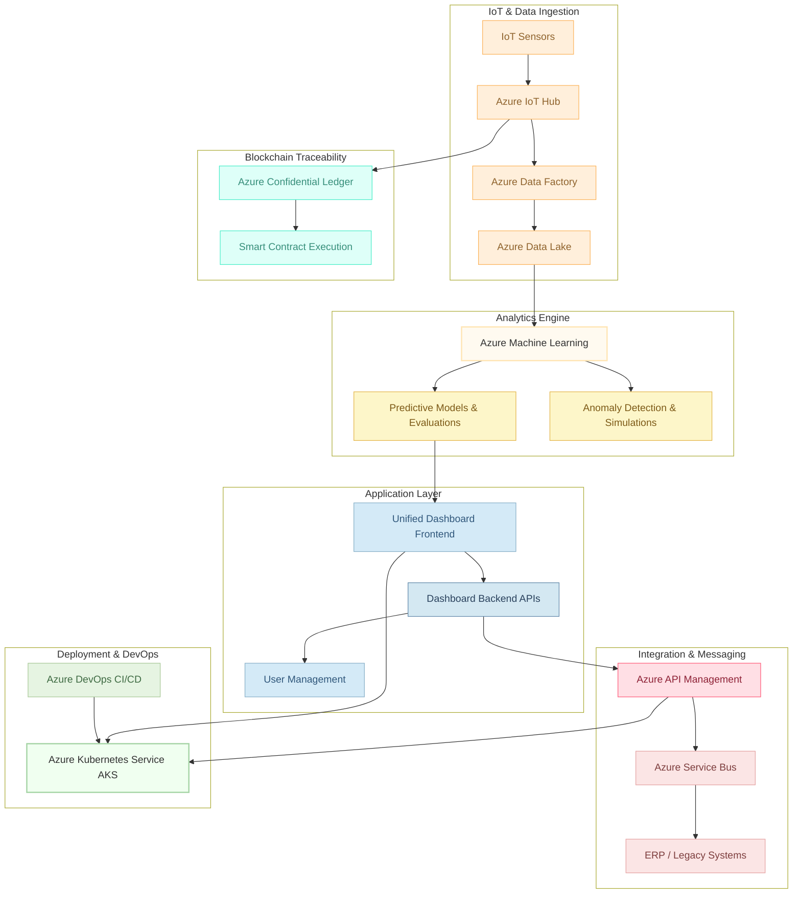

## Architecture and Engineering Overview

AlumiCatalyst is a modular, microservices-based digital transformation platform for aluminum manufacturing built on Microsoft Azure. It is designed to capture real-time sensor data, perform advanced analytics, enforce blockchain-based traceability, and deliver a unified, customizable dashboard—all while ensuring high scalability, robust security, and continuous operational excellence.

This document outlines the complete architecture, technical stack, core modules, data flows, and security parameters. It also details how the system components interconnect and are orchestrated for enterprise-grade performance.

---

### 1. System Architecture Overview

#### Core Components & Modules

1. **IoT & Data Ingestion**
   - **Azure IoT Hub:**  
     - Captures real-time data from deployed IoT sensors on the production floor.
     - Ensures secure communication between sensors and cloud.
   - **Azure Data Factory:**  
     - Transforms and preprocesses raw sensor data.
     - Supports both real-time and batch processing from legacy systems.
   - **Azure Data Lake:**  
     - Central repository for storing raw and processed data.
     - Enables large-scale data storage and analytics.

2. **Analytics Engine**
   - **Azure Machine Learning:**  
     - Hosts predictive models for forecasting scrap loss and carbon emissions.
     - Supports continuous retraining and model refinement based on live data.
   - **Analytics Services:**  
     - Anomaly detection, “what‑if” simulation, and performance evaluation.
   - **Azure Synapse Analytics & Power BI:**  
     - Provide advanced data visualization and interactive reporting.

3. **Blockchain Traceability**
   - **Azure Confidential Ledger:**  
     - Implements an immutable ledger for recording production events.
     - Provides transparent and verifiable data for regulatory compliance and carbon credit reporting.
   - **Smart Contracts:**  
     - Execute predefined rules for event logging and automated reporting.

4. **Application Layer (Dashboard & UI)**
   - **Frontend (React):**  
     - Delivers a responsive, interactive, and customizable user interface.
     - Designed for real-time display of KPIs, alerts, and data visualizations.
   - **Backend (Node.js/Python):**  
     - Aggregates data from multiple modules.
     - Provides RESTful APIs for dashboard operations and user management.

5. **Integration & Messaging**
   - **Azure API Management:**  
     - Exposes secure, versioned APIs for integration with ERP and legacy systems.
   - **Azure Service Bus:**  
     - Facilitates asynchronous communication and message queuing between microservices.
   - **Data Connectors:**  
     - Enable seamless data synchronization with external systems.

6. **Deployment & DevOps**
   - **Azure Kubernetes Service (AKS):**  
     - Hosts containerized microservices for scalable and resilient deployment.
   - **Azure DevOps CI/CD:**  
     - Automates build, test, and deployment processes using pipelines and Helm charts.
   - **Monitoring & Logging:**  
     - Utilizes Azure Monitor and Application Insights for real-time performance tracking and alerting.

---

### 2. Technical Stack

| **Category**              | **Components**                                                                                          |
|---------------------------|---------------------------------------------------------------------------------------------------------|
| **Cloud Platform**        | Microsoft Azure                                                                                         |
| **Compute & Orchestration** | Azure Kubernetes Service (AKS) Azure Functions for serverless processing                              |
| **Data Services**         | Azure IoT Hub Azure Data Factory Azure Data Lake Azure SQL Database                              |
| **Analytics & AI**        | Azure Machine Learning Azure Synapse Analytics Power BI for visualization                         |
| **Blockchain**            | Azure Confidential Ledger                                                                               |
| **Security**              | Azure Active Directory (RBAC) Azure Key Vault                                                        |
| **Integration**           | Azure API Management Azure Service Bus                                                               |
| **DevOps**                | Azure DevOps CI/CD pipelines Helm charts for deployment management                                   |

---

### 3. Data Flow & Security

### Data Flow Process
- **Primary Flow:**  
  1. **Sensors → Azure IoT Hub:** Real-time sensor data is captured.
  2. **IoT Hub → Azure Data Factory:** Data is preprocessed and transformed.
  3. **Data Factory → Azure Data Lake:** Data is stored for long-term analysis.
  4. **Data Lake → Azure Machine Learning:** Data is used to generate predictive insights.
  5. **Azure ML → Dashboard/API:** Predictions and analytics are served to the user interface.
- **Blockchain Integration:**  
  - In parallel, IoT Hub forwards production events to the Azure Confidential Ledger for immutable logging.

#### Security Measures
- **Encryption:** Data is encrypted in transit (TLS) and at rest.
- **Access Control:** Role-based access using Azure Active Directory.
- **Compliance:** Regular security audits and continuous compliance monitoring.
- **Logging & Monitoring:** Azure Monitor and Application Insights provide end-to-end logging and performance tracking.

---

### 4. Detailed Mermaid Diagram

Below is the detailed Mermaid diagram for the overall system architecture:

