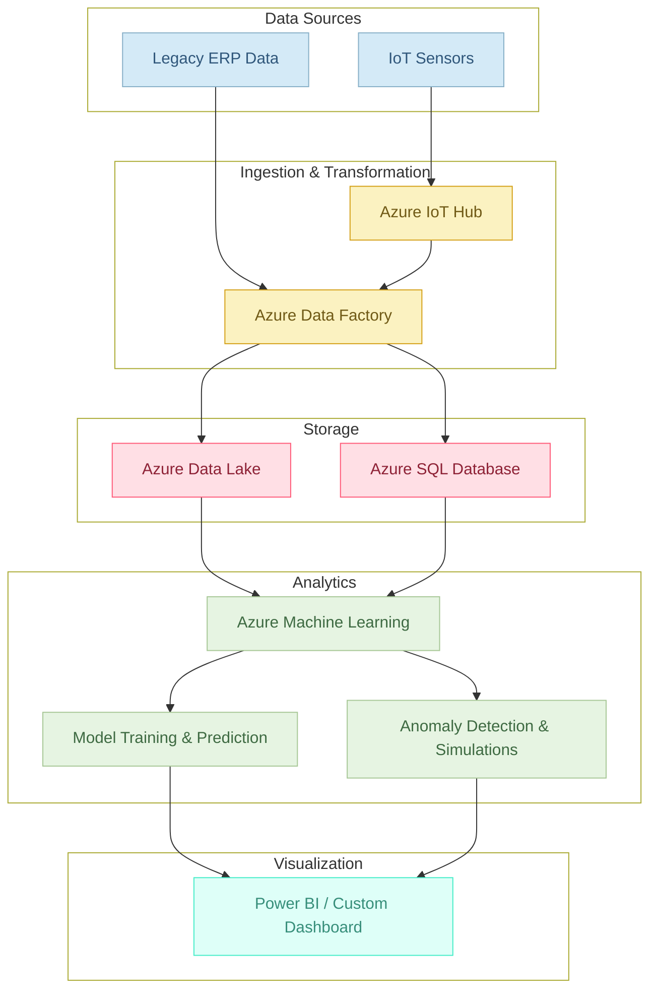

## Data and Analytics Integration

### Overview
AlumiCatalyst leverages a robust data integration pipeline to capture, process, and analyze real-time and batch data from production systems. This document outlines the end‑to‑end data flow, the transformation processes, and the integration with business intelligence tools to provide actionable insights.

### Data Sources
- **IoT Sensors:**  
  Real‑time data ingestion via Azure IoT Hub.
- **Legacy Systems:**  
  Batch imports from ERP, SCADA, and other existing databases.

### Data Pipeline Architecture(check the diagram below)
1. **Ingestion:**  
   - **Azure IoT Hub:** Captures real-time sensor data.
   - **Batch Imports:** Scheduled extraction from legacy systems using Azure Data Factory.
2. **Transformation:**  
   - **Azure Data Factory:** Processes raw data, cleanses it, and transforms it into structured formats.
   - **Data Preprocessing:** Applies cleaning rules, normalization, and aggregation (detailed in preprocessing modules).
3. **Storage:**  
   - **Azure Data Lake:** Central repository for raw and processed data.
   - **Azure SQL Database:** Stores structured data for immediate querying and reporting.
4. **Analytics:**  
   - **Azure Machine Learning:** Processes data to generate predictive insights and anomaly detection.
   - **Azure Synapse Analytics & Power BI:** Enable advanced reporting and visualization.

### Data Governance and Security
- **Data Dictionary & Schema:**  
  Maintain version-controlled definitions for all data elements.
- **Quality Assurance:**  
  ETL pipelines enforce schema consistency and perform data quality checks.
- **Access Control:**  
  Role-based access using Azure Active Directory.
- **Encryption:**  
  All data is encrypted in transit and at rest.

### Integration with BI Tools
- **Real-time Dashboards:**  
  Data is exposed to Power BI and custom dashboards for live monitoring.
- **APIs:**  
  RESTful endpoints provide data access for external systems and analytics.

### Best Practices
- Regular audits of ETL pipelines.
- Automated monitoring using Azure Monitor and Data Factory alerts.
- Periodic reviews of data governance policies.

